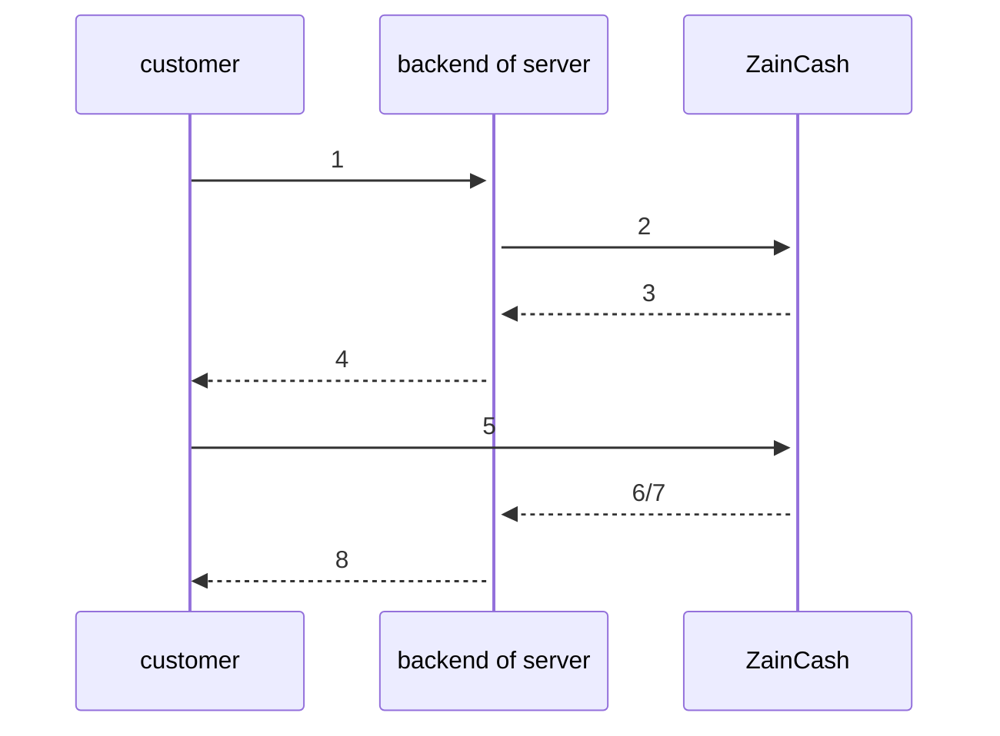

# Transaction flow
The flow of the transaction of ZainCash can be simplified into the following points:

- FE - Customer start the payment process from website or mobile.
- BE - A request is being sent from the backend to ZainCash to create a Transaction ID ( example ). containing the following parameters:
    - <strong>amount</strong> `integer` - The amount for the transaction, IQD only and min is 250.
    - <strong>serviceType</strong> `string` - Title or info for the transaction, example: "a book".
    - <strong>msisdn</strong> `long integer` - The mobile phone number for your wallet, example format: 9647802999569.
    - <strong>orderId</strong> `string` - a reference for your system to update your tables on, example: "229" or "ss22".
    - <strong>redirectUrl</strong> `string` - a link for your website to receive the user on after he finish his payment. this is used as a webhook as well for the indication of the user's transaction status.
- ZainCash return a Transaction ID to the backend
- BE - The Customer is redirected to the link `https://ZAIN_CASH_API/transaction/pay?id=TRANSACTION_ID`, replace `TRANSACTION_ID` with the received Transaction ID and `ZAIN_CASH_API` with the <strong>API</strong> of zaincash for if it is on test or live, the APIs mentioned previously.
- FE - The Customer finish the transaction and is then automatically redirected to the redirectUrl of the transaction.
- BE - The backend decodes the token parameter received for the redirectUrl link to indicate the state of the transaction.
- BE - System tables updated.
- FE - Customer notified.

The below diagram explains the flow.

